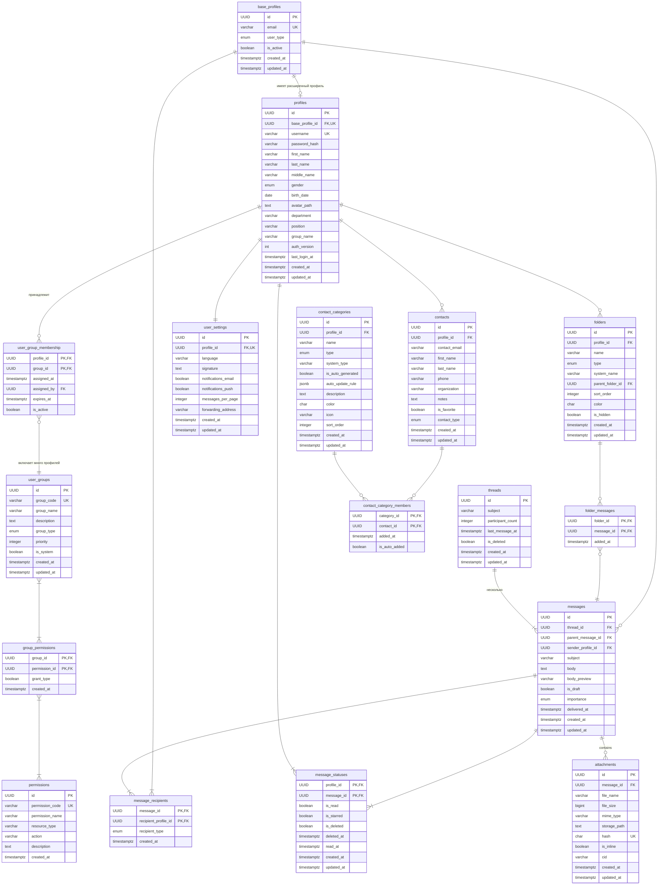

# ДЗ 1

## 1. Функциональные зависимости и нормализация

### Отношение: `base_profiles`

Хранит базовую идентификационную информацию о всех пользователях почтовой системы (студенты, преподаватели, сотрудники, внешние пользователи).

##### Функциональные зависимости:

1. `{id} -> username, domain, email, user_type, is_active, created_at, updated_at`
2. `{username, domain} -> id, email, user_type, is_active, created_at, updated_at`
3. `{email} -> id, username, domain, user_type, is_active, created_at, updated_at`

##### Анализ нормализации:

- 1НФ: Все атрибуты атомарны (username и domain хранятся отдельно, email вычисляемое поле не хранится)
- 2НФ: Полная зависимость от простого ключа
- 3НФ: Нет транзитивных зависимостей (все неключевые атрибуты зависят только от ключа)
- НФБК: Все детерминанты ({id}, {username, domain}, {email}) являются суперключами

### Отношение: `profiles`

Содержит расширенную персональную информацию о пользователях, связанную с базовым профилем.

##### Функциональные зависимости:

1. `{id} -> base_profile_id, password_hash, first_name, last_name, middle_name, gender, birth_date, avatar_path, department, position, group_name, auth_version, last_login_at, created_at, updated_at`
2. `{base_profile_id} -> id, password_hash, first_name, last_name, middle_name, gender, birth_date, avatar_path, department, position, group_name, auth_version, last_login_at, created_at, updated_at`

##### Анализ нормализации:

- 1НФ: Все атрибуты атомарны (ФИО разделены на составляющие)
- 2НФ: Полная зависимость от простого ключа
- 3НФ: Нет транзитивных зависимостей
- НФБК: Все детерминанты ({id}, {base_profile_id}) являются суперключами

### Отношение: `user_groups`

Содержит информацию о группах пользователей (студенты, преподаватели, административный персонал)

##### Функциональные зависимости:

1. `{id} → group_code, group_name, description, group_type, priority, is_system, created_at, updated_at`
2. `{group_code} → id, group_name, description, group_type, priority, is_system, created_at, updated_at`

##### Анализ нормализации:

- 1НФ: Все атрибуты атомарны
- 2НФ: Полная зависимость от простого ключа
- 3НФ: Нет транзитивных зависимостей
- НФБК: Все детерминанты ({id}, {group_code}) являются суперключами

### Отношение: `permissions`

Содержит информацию о различных правах, назначаемых группам пользователей

##### Функциональные зависимости:

1. `{id} → permission_code, permission_name, resource_type, action, description, created_at`
2. `{permission_code} → id, permission_name, resource_type, action, description, created_at`

##### Анализ нормализации:
- 1НФ: Все атрибуты атомарны
- 2НФ: Простой ключ id
- 3НФ: Нет транзитивных зависимостей
- НФБК: Все детерминанты ({id}, {permission_code}) являются суперключами

### Отношение: `group_permissions`

Содержит информацию о связи между группами пользователей и правами, им наделенными

##### Функциональные зависимости:

1. `{group_id, permission_id} → grant_type, created_at`

##### Анализ нормализации:
- 1НФ: Все атрибуты атомарны
- 2НФ: Полная зависимость от составного ключа
- 3НФ: Нет транзитивных зависимостей
- НФБК: Единственный детерминант является суперключом

### Отношение: `user_group_membership`

Содержит информацию о принадлежности пользователя к группе

##### Функциональные зависимости:

1. `{profile_id, group_id} → assigned_at, assigned_by, expires_at, is_active`

##### Анализ нормализации:
- 1НФ: Все атрибуты атомарны
- 2НФ: Полная зависимость от составного ключа
- 3НФ: Нет транзитивных зависимостей
- НФБК: Единственный детерминант является суперключом

### Отношение: `contact_categories`

Содержит информацию о категориях контактов пользователей (например, преподаватели, одногруппники и т.п.)

##### Функциональные зависимости:

1. `{id} → profile_id, name, type, system_type, is_auto_generated, description, color, icon, sort_order, created_at, updated_at`
2. `{profile_id, name} → id, type, system_type, is_auto_generated, description, color, icon, sort_order, created_at, updated_at`
3. `{profile_id, system_type} → id, name, type, is_auto_generated, description, color, icon, sort_order, created_at, updated_at`

##### Анализ нормализации:

- 1НФ: Все атрибуты атомарны
- 2НФ: Полная зависимость от простого ключа
- 3НФ: Нет транзитивных зависимостей
- НФБК: Все детерминанты являются суперключами

### Отношение: `contact_category_members`

Содержит информацию о связи между контактом и категорией

##### Функциональные зависимости:

1. `{category_id, contact_id} → is_auto_added, added_at, updated_at`

##### Анализ нормализации:

- 1НФ: Атомарные атрибуты
- 2НФ: Полная зависимость от составного ключа
- 3НФ: Нет транзитивных зависимостей
- НФБК: Единственный детерминант является суперключом

### Отношение: `threads`

Представляет цепочки писем (треды), объединяющие связанные сообщения.

##### Функциональные зависимости:

1. `{id} -> subject, participant_count, last_message_at, is_deleted, created_at, updated_at`

##### Анализ нормализации:

- 1НФ: Все атрибуты атомарны
- 2НФ: Полная зависимость от простого ключа
- 3НФ: Нет транзитивных зависимостей
- НФБК: Единственный детерминант {id} является суперключом

### Отношение: `messages`

Хранит отдельные письма с их содержимым и метаданными.

##### Функциональные зависимости:

1. `{id} -> thread_id, parent_message_id, sender_profile_id, subject, body, body_preview, is_draft, importance, delivered_at, created_at, updated_at`
2. `{thread_id, created_at} -> id` (порядок сообщений в треде)

##### Анализ нормализации:

- 1НФ: Все атрибуты атомарны
- 2НФ: Полная зависимость от простого ключа
- 3НФ: Нет транзитивных зависимостей (importance - перечислимый тип, не зависит от других неключевых атрибутов)
- НФБК: Все детерминанты ({id}) являются суперключами

### Отношение: `message_recipients`

Связывает сообщения с получателями, поддерживая множественную отправку и различные типы получателей (to, cc, bcc).

##### Функциональные зависимости:

1. `{message_id, recipient_profile_id} -> recipient_type, created_at`

##### Анализ нормализации:

- 1НФ: Атомарные атрибуты
- 2НФ: Полная зависимость от составного ключа
- 3НФ: Нет транзитивных зависимостей
- НФБК: Единственный детерминант {message_id, recipient_profile_id} является суперключом

### Отношение: `folders`

Определяет системные и пользовательские папки для организации писем.

##### Функциональные зависимости:

1. `{id} -> profile_id, name, type, system_name, parent_folder_id, sort_order, color, is_hidden, created_at, updated_at`
2. `{profile_id, system_name} -> id, name, type, parent_folder_id, sort_order, color, is_hidden (для системных папок)`

##### Анализ нормализации:

- 1НФ: Атомарные атрибуты
- 2НФ: Полная зависимость от простого ключа
- 3НФ: Нет транзитивных зависимостей
- НФБК: Все детерминанты ({id}, {profile_id, system_name}) являются суперключами

### Отношение: `folder_messages`

Реализует связь многие-ко-многим между папками и сообщениями (письмо может быть в нескольких папках).

##### Функциональные зависимости:

1. `{folder_id, message_id} -> added_at`

##### Анализ нормализации:

- 1НФ: Атомарные атрибуты
- 2НФ: Полная зависимость от составного ключа
- 3НФ: Нет транзитивных зависимостей
- НФБК: Единственный детерминант является суперключом

### Отношение: `message_statuses`

Отслеживает статусы сообщений для каждого пользователя (прочитано, помечено, удалено).

##### Функциональные зависимости:

1. `{profile_id, message_id} -> is_read, is_starred, is_deleted, deleted_at, read_at, created_at, updated_at`

##### Анализ нормализации:

- 1НФ: Атомарные атрибуты
- 2НФ: Полная зависимость от составного ключа
- 3НФ: Нет транзитивных зависимостей
- НФБК: Единственный детерминант является суперключом

### Отношение: `attachments`

Хранит информацию о файлах, прикрепленных к письмам.

##### Функциональные зависимости:

1. `{id} -> message_id, file_name, file_size, mime_type, storage_path, hash, is_inline, cid, created_at, updated_at`
2. `{message_id, file_name} -> id` (уникальность имени в рамках письма)
3. `{hash} -> message_id, file_name, file_size, mime_type` (для дедупликации)

##### Анализ нормализации:

- 1НФ: Атомарные атрибуты
- 2НФ: Полная зависимость от простого ключа
- 3НФ: Нет транзитивных зависимостей
- НФБК: Все детерминанты ({id}, {message_id, file_name}, {hash}) являются суперключами

### Отношение: `user_settings`

Хранит настройки и предпочтения пользователя.

##### Функциональные зависимости:

1. `{id} -> profile_id, language, theme, timezone, signature, notifications_email, notifications_push, messages_per_page, forwarding_address, auto_reply_enabled, auto_reply_text, created_at, updated_at`
2. `{profile_id} -> id, language, theme, timezone, signature, notifications_email, notifications_push, messages_per_page, forwarding_address, auto_reply_enabled, auto_reply_text, created_at, updated_at`

##### Анализ нормализации:

- 1НФ: Атомарные атрибуты
- 2НФ: Полная зависимость от простого ключа
- 3НФ: Нет транзитивных зависимостей
- НФБК: Все детерминанты ({id}, {profile_id}) являются суперключами

### Отношение: `contacts`

Хранит персональные контакты пользователей.

##### Функциональные зависимости:

1. `{id} -> profile_id, contact_email, first_name, last_name, phone, organization, notes, is_favorite, created_at, updated_at`
2. `{profile_id, contact_email} -> id, first_name, last_name, phone, organization, notes, is_favorite, created_at, updated_at`

##### Анализ нормализации:

- 1НФ: Атомарные атрибуты
- 2НФ: Полная зависимость от простого ключа
- 3НФ: Нет транзитивных зависимостей
- НФБК: Все детерминанты ({id}, {profile_id, contact_email}) являются суперключами

## 2. ER-диаграмма

